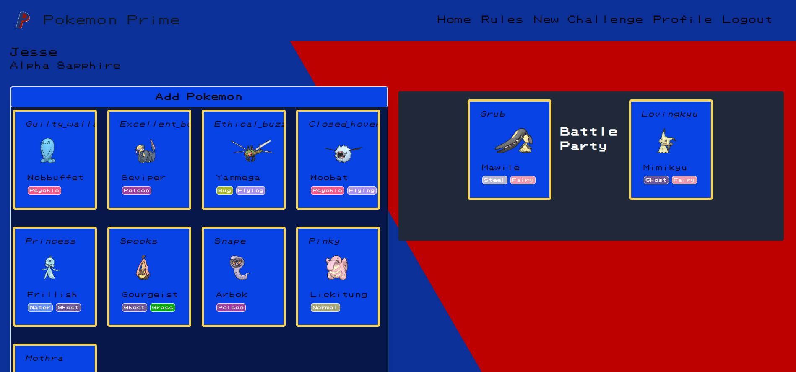
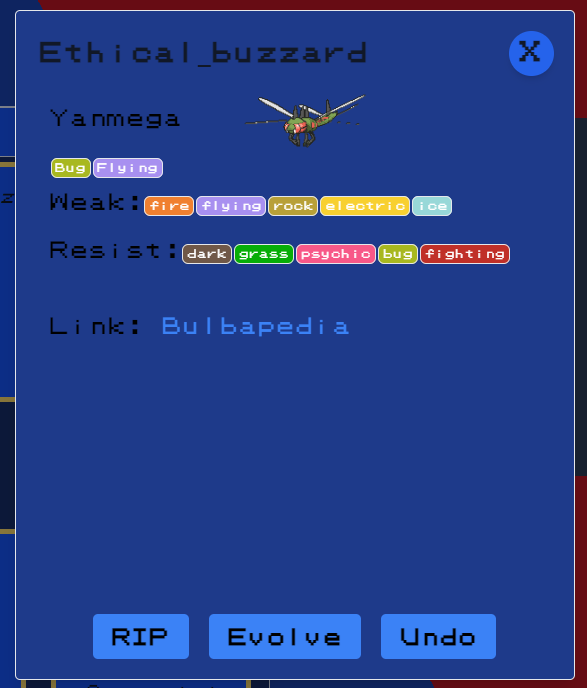

# Pokemon-Prime

## Description

Welcome to our Pokemon nuzlocke app. With our app you can track your progression in a nuzlocke! You can enter the pokemon you catch, their name, and original pokemon name. We also have a designated spot for your KO pokemon, R.I.P. let our app track your progress with your account when you log in, you will have your very own profile with your wins, and losses!

Enjoy!

This project was made with some type of user token, so you'll have to create an account to access the main challenge page. Once you create an account you will have access to the Challenge page via the naviation. Once on the challenge page you can add pokemon to your roster by clicking the "Add Pokemon" button. A modal will prompt you to enter a nickname and species. Fill out the prompt and click add. This will make an api call to fetches the details of the species that was inputed. Once the api call ends your pokemon will join your roster. A card will generate for your pokemon that has the following details: nickname, sprite, species, type(s). 


Since there are a variety of pokemon each with different detials, so we had to put some checks in to prevent errors. For example there are pokemon with multiple types, but there are plenty of single type pokemon in the game. A simple if/else statement solved that issue.
```javascript
if (data.getPokemon.types.length > 1) {
        for (let i = 0; i < data.getPokemon.types.length; i++) {
             weakness = weakness.concat(data.getPokemon.types[i].matchup.defending.effectiveTypes);
            }
} else {
            weakness = data.getPokemon.types[0].matchup.defending.effectiveTypes;
        }
```

Dragula is the main technology we use to make the cards into dragable components. It was quick and easy to implement which was the main factor why we used it on this project. Dragula has a mirror feature which makes it easy to understand where a card can be dropped. Otherwise the card will return to its original position.


## Table of Contents

- [Technologies Utilized](#technologies-utilized)
- [Local Installation & Usage](#local-installation--usage)
- [Screenshot](#screenshot)
- [Deployed Application](#deployed-application)
- [Contact](#contacts)

## Deployed Application

[pokemonprime.herokuapp.deploy](https://pokemon--prime.herokuapp.com/)

## Technologies Utilized 
<a name="technologies-utilized"></a>

- [MongoDB Atlas](https://www.mongodb.com/cloud/atlas)
- [Heroku](https://www.heroku.com)
- [NPM Apollo-Server-Express Package](https://www.npmjs.com/package/apollo-server-express)
- [NPM GraphQL Package](https://www.npmjs.com/package/graphql)
- [NPM Bcrypt Package](https://www.npmjs.com/package/bcrypt)
- [NPM Express.js Package](https://www.npmjs.com/package/express)
- [NPM JSONWebToken](https://www.npmjs.com/package/jsonwebtoken)
- [NPM Mongoose Package](https://www.npmjs.com/package/mongoose)
- [Node.js](https://nodejs.org/en/)
- [NPM nodemon Package](https://www.npmjs.com/package/nodemon)
- [NPM JWT-Decode Package](https://www.npmjs.com/package/jwt-decode)
- [NPM React Package](https://www.npmjs.com/package/react)
- [tailwindcss](https://www.npmjs.com/package/tailwindcss)
- [React-Dom](https://www.npmjs.com/package/react-dom)
- [React-Router-Dom](https://www.npmjs.com/package/react-router-dom)
- [React-Scripts](https://www.npmjs.com/package/react-scripts)

## Local Installation & Usage 
<a name="local-installation--usage"></a>

To use this app, you will need a MongoDB account, and to have the app installed on your machine. Documentation with installation instructions are available [here.](https://docs.mongodb.com/manual/installation/)

STEP 1
From your terminal, run:

    npm intall

STEP 2

    npm run seed

STEP 3

    npm run develop

STEP 4

From the modern browser of your choice, visit:

     http://localhost:3000

## Screenshot
<a name="screenshot"></a>





# Contacts

## Angela Amaro

[My GitHub](https://github.com/Angela-Amaro)

[My Linkedin](https://www.linkedin.com/in/angela-amaro/)

## Angel Matius

[My GitHub](https://github.com/robogf)

[My Linkedin](https://www.linkedin.com/in/angel-matias-01120b251/)

## Jeff Chan

[My GitHub](https://github.com/chanjeff520)

[My Linkedin](https://www.linkedin.com/in/jefflchan/)

## Jonathan Moreno

[My GitHub](https://github.com/johnfrom209)

[My Linkedin](https://www.linkedin.com/in/johnfrom209/)
